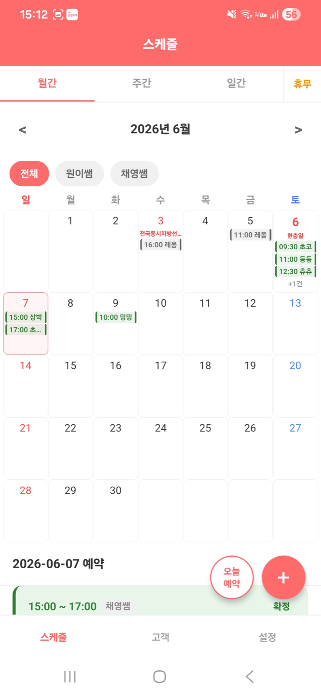
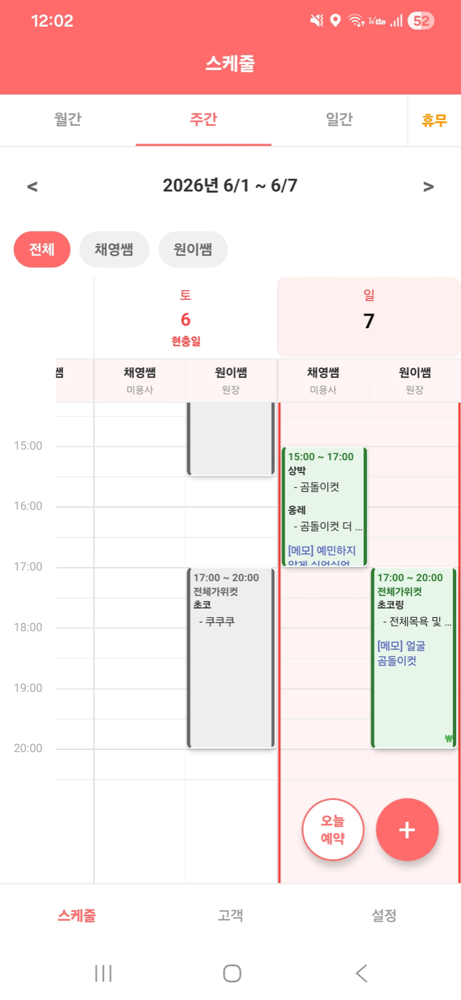
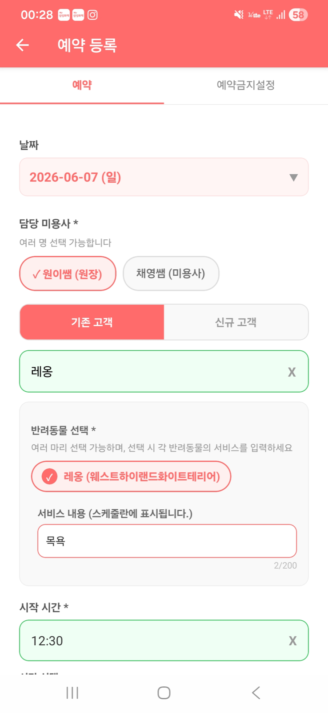
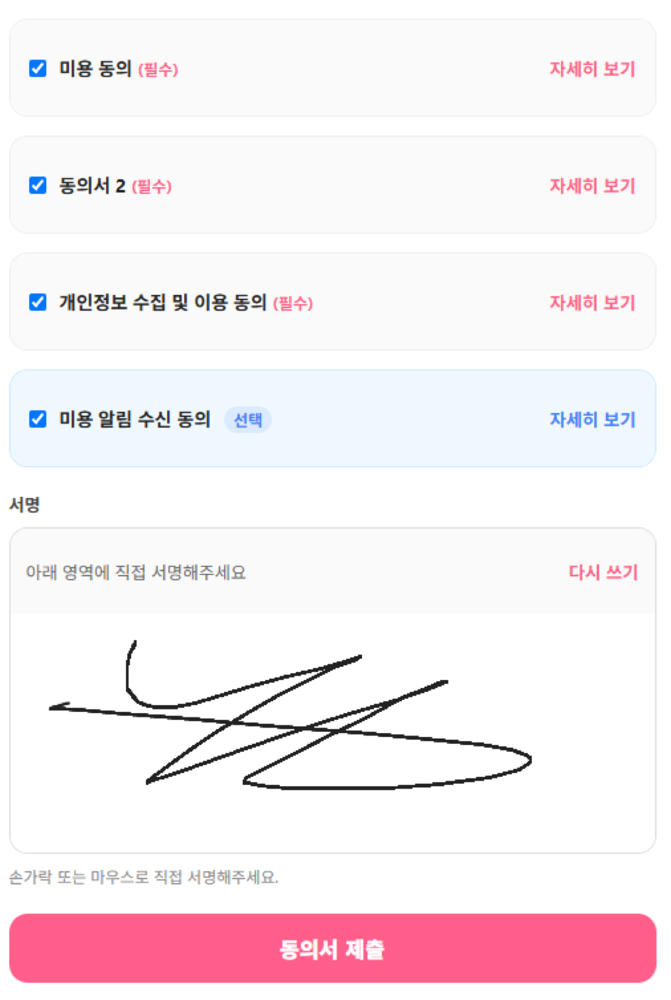
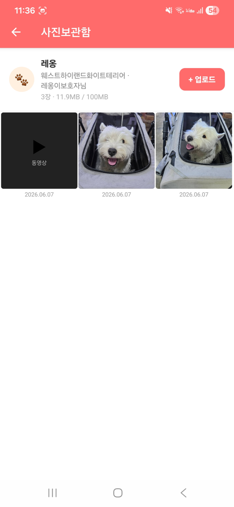
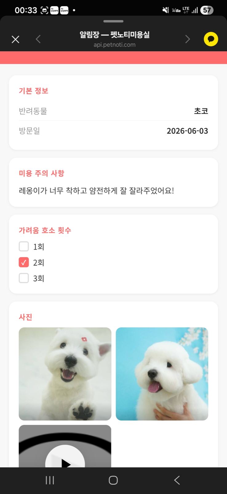
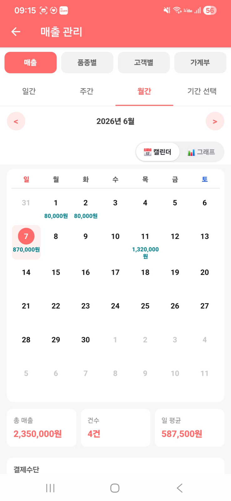
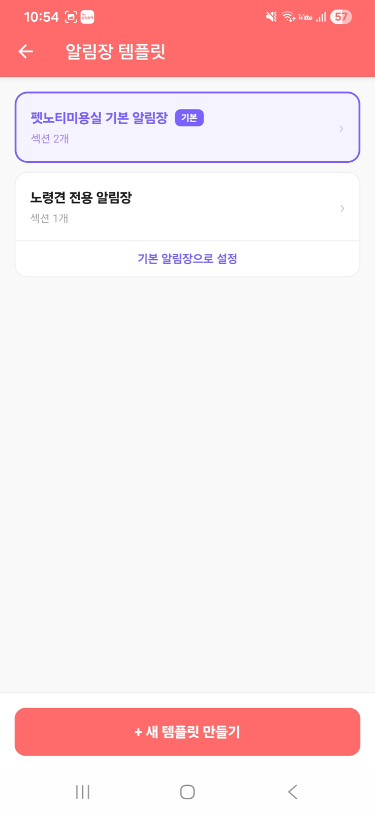
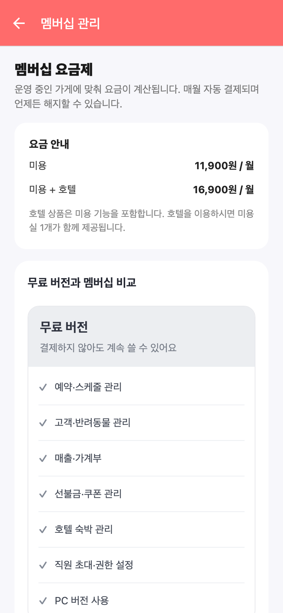
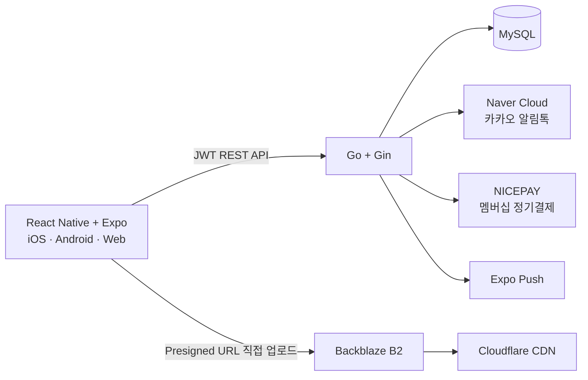

  
  <h1>펫노티 (Petnoti)</h1>
  
<strong>예약부터 고객 알림장, 호텔, 매출까지 한곳에서 관리하는 반려동물 미용실 운영 서비스</strong>

  

    <a href="https://petnoti.com">웹에서 체험하기</a> ·
    <a href="https://apps.apple.com/kr/app/펫노티/id6780870798">App Store</a> ·
    <a href="https://play.google.com/store/apps/details?id=com.cozyncomfy.petnoti">Google Play</a> ·
    <a href="https://guide.petnoti.com">사용 설명서</a>
  

> ### 바로 체험하기
> **웹 접속:** [https://petnoti.com](https://petnoti.com) 
> **테스트 아이디:** `test@test.com` 
> **테스트 비밀번호:** `test123456`

> 현재 iOS, Android, Web에서 실제 운영 중인 상용 서비스입니다. 서비스 소스 코드는 비공개이며, 이 저장소에는 프로젝트 소개와 실행 화면을 담았습니다.

> **카카오 알림톡 실제 연동 완료** — Naver Cloud Platform 알림톡 API를 연동해 예약 확정·변경·취소, 방문 전 리마인드, 미용주기 안내, 전자 동의서와 사진·동영상 알림장을 고객의 카카오톡으로 자동 발송합니다.

> **NICEPAY 실결제 연동 완료** — 요금 안내 화면만 구현한 데모가 아니라, 카드 등록과 빌링키 발급부터 최초 결제, 매월 자동 정기결제, 결제 실패 처리, 카드 변경, 구독 해지까지 실제 상용 결제 흐름을 구현했습니다.

## 프로젝트 소개

기존 미용실 관리 도구의 높은 비용과 불편한 사용 흐름을 개선하기 위해 시작했습니다. 실제 애견미용실 운영자의 피드백을 받아 예약, 고객·반려동물 기록, 카카오 알림톡, 전자 동의서, 사진·동영상 알림장, 호텔, 매출 관리를 하나의 서비스로 구현했습니다.

- 개발 형태: 1인 기획·디자인·풀스택 개발·배포·운영
- 지원 환경: iOS / Android / PC·모바일 Web
- 운영 형태: NICEPAY 카드 실결제가 적용된 멤버십 기반 상용 서비스

## 주요 화면

### 예약과 스케줄

월간·주간·일간 스케줄을 지원하며, 담당 미용사별 예약과 휴무를 한눈에 확인할 수 있습니다. 예약 등록 시 고객과 반려동물, 서비스 시간, 담당자, 알림톡 발송 여부를 함께 관리합니다.

  
  
  

### 고객 커뮤니케이션

미용 전자 동의서를 받고, 작업이 끝나면 사진·동영상과 코멘트가 포함된 알림장을 카카오 알림톡으로 전달합니다. 고객은 앱 설치 없이 웹 링크에서 결과를 확인할 수 있습니다.

  
  
  

### 매장 운영

매출 달력과 가계부, 알림장 템플릿, 직원 권한, 선불금·쿠폰, 호텔 숙박을 관리합니다. 매장 규모와 호텔 사용 여부에 따라 멤버십 요금이 계산되며, NICEPAY를 통해 실제 카드 등록과 정기결제가 이루어집니다.

  
  
  

## 핵심 기능

| 영역 | 기능 |
|---|---|
| 예약·스케줄 | 월간·주간·일간 보기, 담당자별 예약, 예약 중복 검사, 휴무·영업시간 관리 |
| 고객·반려동물 | 다중 연락처, 미용 이력, 체중·특이사항 기록, 선불금·쿠폰, 미디어 갤러리 |
| 카카오 알림톡 | Naver Cloud Platform API 직접 연동, 예약 확정·변경·취소, 방문 전 리마인드, 미용주기 자동 안내, 발송 결과 추적 |
| 전자 동의서·알림장 | 카카오 알림톡으로 전자서명 링크와 사진·동영상 미용 알림장 발송, 고객은 앱 설치 없이 웹에서 확인 |
| 호텔 | 객실·수용량, 체크인·체크아웃, 숙박·시간 요금, 돌봄 기록, 매출 연동 |
| 매장 관리 | 직원 초대와 세부 권한, 담당자별 매출·인센티브, 가계부, NICEPAY 카드 실결제·멤버십 정기결제 |

## 시스템 구성

## 기술적 구현

### 하나의 코드베이스로 세 플랫폼 지원

React Native와 Expo로 iOS, Android, Web을 함께 개발했습니다. React Navigation으로 화면 흐름을 구성하고, Axios interceptor에서 JWT와 선택 매장 정보를 모든 API 요청에 일관되게 적용했습니다. 모바일 우선 반응형 UI와 웹의 마우스 상호작용을 함께 지원합니다.

### 대용량 미디어 업로드 구조

서버가 업로드용 presigned URL을 발급하고 클라이언트가 Backblaze B2로 직접 전송합니다. 이미지와 동영상은 업로드 전에 앱의 정책에 맞게 리사이즈·압축해 저장 비용과 전송량을 줄였으며, 조회 트래픽은 Cloudflare CDN을 통해 전달합니다.

### 데이터 무결성과 권한 보호

여러 데이터를 한 번에 저장하는 기능은 단일 API와 DB 트랜잭션으로 처리해 부분 저장을 방지했습니다. 직원 권한은 화면 노출뿐 아니라 서버에서도 다시 검증하며, 권한이 없을 때 다른 값으로 조용히 대체하지 않고 명확한 오류를 반환합니다.

### 카카오 알림톡 자동화

Naver Cloud Platform의 알림톡 API를 실제 서비스에 연동했습니다. 예약 확정·변경·취소 알림은 사용자 선택에 따라 즉시 발송하고, 방문 전 리마인드와 미용주기 안내는 Go 스케줄러가 자동 처리합니다. 전자 동의서와 미용 알림장에는 고객별 웹 링크를 넣어 앱을 설치하지 않아도 서명하거나 사진·동영상을 확인할 수 있도록 구현했으며, 비동기 발송과 결과 조회로 전송 상태도 관리합니다.

### NICEPAY 상용 결제 연동

카드 정보를 NICEPAY로 암호화 전송해 빌링키를 발급하고, 서버에는 빌링키와 마스킹된 카드 정보만 저장합니다. 최초 결제와 매월 자동 청구뿐 아니라 가게 추가 시 일할 결제, 결제 이력, 중복 청구 방지를 위한 멱등키, 실패 재시도와 이용 제한, 카드 변경, 구독 해지까지 실제 멤버십 결제 주기를 구현했습니다.

### 비동기 작업과 자동화

Go goroutine 기반 스케줄러가 예약 상태 변경, 예약 리마인드, 미용주기 안내, 오래된 미디어 정리 등을 수행합니다. 외부 메시지 발송과 결과 조회도 비동기로 처리해 API 응답 지연을 줄였습니다.

### 직접 구축한 운영 환경

Mac mini M4에 API, 웹, DB를 운영하고 Cloudflare Tunnel로 외부에 안전하게 연결했습니다. `launchd`로 프로세스 자동 복구와 상태 모니터링을 구성했으며, 매일 MySQL 백업을 압축해 로컬 외장 저장소와 Backblaze B2에 이중 보관합니다.

## 기술 스택

| 구분 | 기술 |
|---|---|
| Frontend | React Native, Expo, TypeScript, React Navigation, Axios |
| Backend | Go, Gin, JWT, REST API |
| Database | MySQL |
| Storage / CDN | Backblaze B2, AWS S3 SDK, Cloudflare CDN |
| External Services | Naver Cloud Platform 알림톡, NICEPAY 빌링·실결제, Expo Notifications |
| Infrastructure | Mac mini M4, Cloudflare Tunnel, launchd |

## 담당 범위

- 실제 매장 인터뷰를 통한 요구사항 정의와 기능 우선순위 결정
- 모바일·웹 UX/UI 설계 및 React Native 구현
- Go REST API, 인증·권한, MySQL 스키마와 트랜잭션 설계
- 알림톡, 결제, 푸시, 오브젝트 스토리지 등 외부 서비스 연동
- 앱스토어·플레이스토어 출시와 서버 배포, 백업, 모니터링 운영

## 링크

- 서비스: [petnoti.com](https://petnoti.com)
- 사용 설명서: [guide.petnoti.com](https://guide.petnoti.com)
- iOS: [App Store에서 보기](https://apps.apple.com/kr/app/펫노티/id6780870798)
- Android: [Google Play에서 보기](https://play.google.com/store/apps/details?id=com.cozyncomfy.petnoti)
